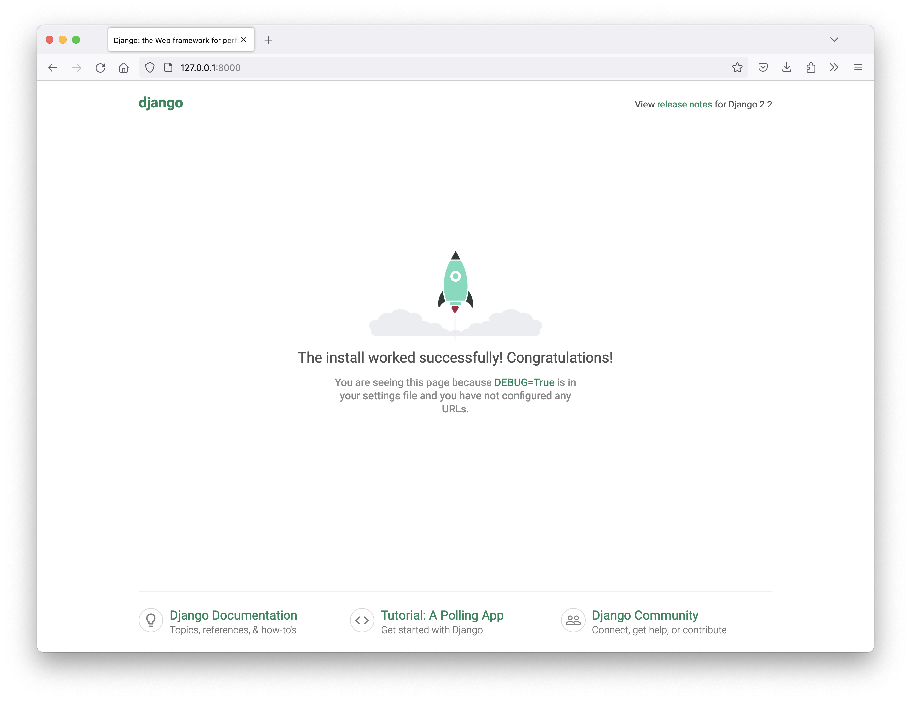
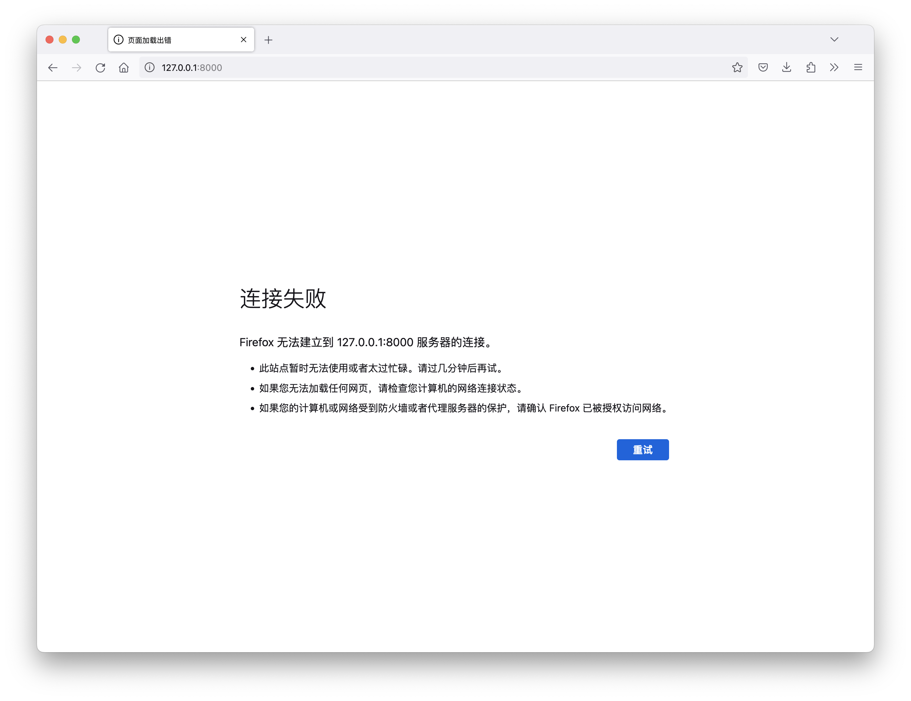

# Django 介绍

- [课程介绍与 Django 介绍](#课程介绍与-django-介绍)
- [Django 项目结构](#django-项目结构)
- [URL 和视图函数](#url-和视图函数)
- [路由配置](#路由配置)

---

## 课程介绍与 Django 介绍

### 课程介绍

| 课程名称 | 内容 | 目标 |
| - | - | - |
| Django 框架 | 创建 Django 项目，配置 Django, URL 及路由，模版层，数据层, 中间件...| 掌握 Django 项目的搭建，制作出精美的网站 |
| Redis 数据库 | Redis 的数据结构, 命令, 事务, 主从, 哨兵... | 掌握 Redis 数据库的数据结构及在一些经典场景中的使用技巧 |
| 电商项目实战 | 用户模块 / 购物车模块 / 订单 / 支付... | 了解企业级的 Django 电商项目是如何从 0 到 1 搭建出来的 |

### Django 介绍

#### 起源

- 2005年发布, 采用 Python 语言编写的开源 web 框架
- 早期的时候 Django 主做新闻和内容管理
- 重量级的 Python Web框架, Django 配备了常用的大部分组件

#### 组件

- 基本配置文件 / 路由系统
- 模型层 (M) / 模版层 (T) / 视图层 (V)
- Cookies 和 Session
- 分页及发邮件
- Admin 管理后台

#### 用途

1. 网站/微信公众号/小程序后端开发

    ```mermaid
    graph LR
    browser[浏览器]
    django[Django]
    browser --HTTP 请求--> django
    django --HTTP 响应--> browser
    ```

2. 人工智能平台融合

    ```mermaid
    graph LR
    program[小程序]
    django[Django]
    ai[人工智能系统]
    taxi([第三方打车平台])
    program <--HTTP--> django 
    django <--HTTP--> ai
    django --HTTP--> taxi
    ```

#### 版本

- Django 官网: http://www.djangoproject.com
- Django 中文文档参考网站: https://yiyibooks.cn
- 版本
  - 最新版本: 3.0.x
  - **当前教学版本: 2.2.12**

#### 安装

支持的 Python 版本: 3.5 ~ 3.8

1. 安装开发环境 Python 3.7, Django 2.2.12

    ```shell
    conda create -n fullstack python=3.7
    activate fullstack
    pip install django==2.2.12
    ```

2. 测试安装是否成功

    ```python
    import django
    django.get_version() # '2.2.12'
    ```

## Django 项目结构

### 创建项目

```python
# django-admin startproject <项目名>
django-admin startproject mysite
ls # mysite
```

### 启动服务

1. 进入项目文件夹

    ```python
    cd mysite
    ls # manage.py mysite
    ```

2. 启动 Django 服务 (测试开发阶段)

    ```python
    # python manage.py runserver <端口号 (默认 8000)>
    python manage.py runserver
    ```

3. 浏览器访问 http://127.0.0.1:8000

    

4. 执行 `ctrl`+`c` 可以关闭服务

    

### 结构解析

```shell
(fullstack) ➜  python_django  tree mysite
# mysite
# ├── db.sqlite3
# ├── manage.py
# └── mysite
#     ├── __init__.py
#     ├── __pycache__
#     │   ├── __init__.cpython-37.pyc
#     │   ├── settings.cpython-37.pyc
#     │   ├── urls.cpython-37.pyc
#     │   └── wsgi.cpython-37.pyc
#     ├── settings.py
#     ├── urls.py
#     └── wsgi.py
# 
# 3 directories, 10 files
```

### `manage.py`

包含项目管理的子命令, 如:

- `python manage.py runserver` 启动服务
- `python manage.py startapp` 创建应用
- `python manage.py migrate` 数据库迁移
- ...
- `python manage.py` 列出所有子命令

### 项目同名文件夹

`mysite/mysite`

- `__init__.py`: Python 包的初始化文件
- `wsgi.py`: Web 服务网关的配置文件 - Django 正式启动时需要用到
- `urls.py`: 项目的主路由配置 - HTTP 请求进入 Django 时优先调用
- `settings.py`: 项目的配置文件 - 包含项目启动时需要的配置

## URL 和视图函数

## 路由配置
